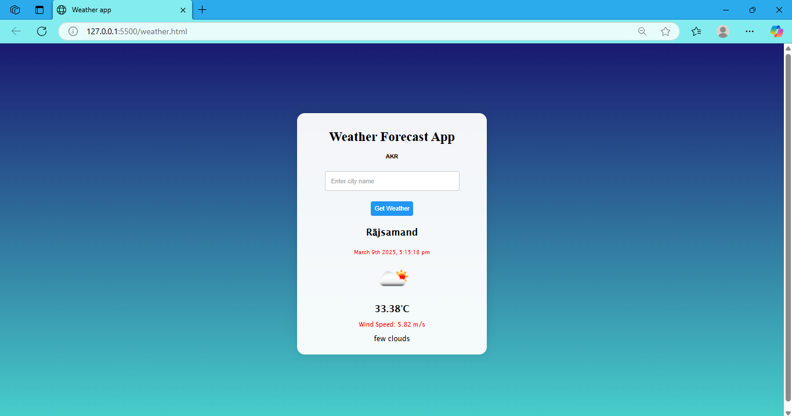

**Weather Forecast Web Application 🌦️**

**📌 Overview**
This is a simple **Weather Forecast Web Application** built using **HTML, CSS, and JavaScript**. It allows users to check real-time weather conditions for any city by fetching data from *OpenWeatherMap API*.  

**🛠️ Features**  
✔ Fetches live weather data using an API  
✔ Displays **temperature, humidity, and weather conditions**  
✔ Dynamic user interface with a clean design  
✔ Easy-to-use city search functionality  

**🖥️ Technologies Used**  
- **Frontend:** HTML, CSS, JavaScript  
- **API:** OpenWeatherMap  

**📌 How to Run the Project?**  
1. Clone this repository:  
   ```sh
   git clone https://github.com/AKR264/Weather-Forecast-App.git
   ```  
2. Open `weather.html` in any web browser.  
3. Enter a city name to view the current weather.  

**📷 Screenshot**  
  

**📩 API Setup (If Needed)**  
If an API key is required, follow these steps:  
1. Sign up at [OpenWeatherMap](https://openweathermap.org/).  
2. Get your free API key.  
3. Replace `"YOUR_API_KEY_HERE"` in the JavaScript file with your actual API key.  

**💡 Future Enhancements (Optional)**  
- Add a **5-day forecast** feature  
- Implement **dark mode UI**  
- Display **weather alerts** for extreme conditions  

**📜 License**  
This project is open-source and free to use under the **MIT License**.  
